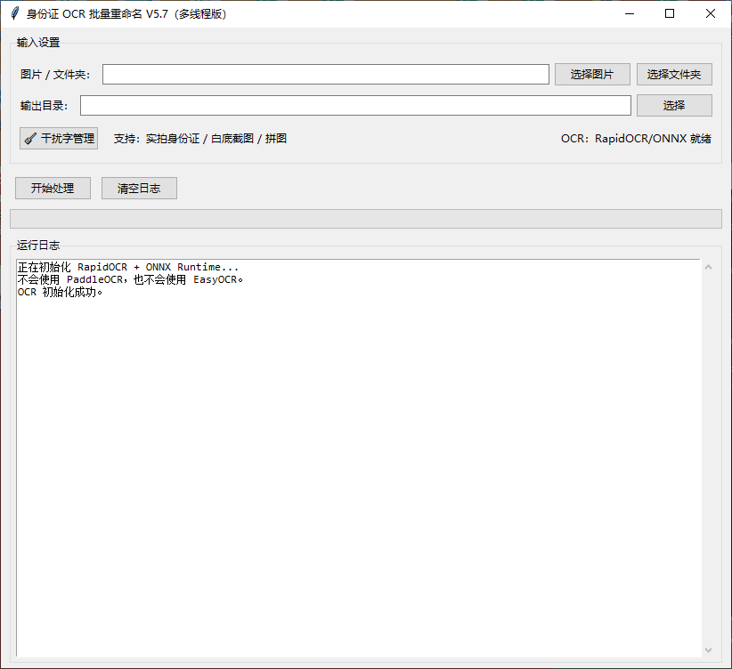

# 身份证 OCR 批量重命名工具

一个基于 RapidOCR + ONNX Runtime 的身份证图片批量识别与重命名工具。支持单张图片、整个文件夹递归处理、多线程并行、拖拽导入、输出目录复制、原目录重命名、干扰字管理、姓名区域动态定位、多候选区域筛选、正面/背面评分、证据分级投票等功能。



## 功能概览

- 身份证图片批量识别姓名
- 支持单张图片处理
- 支持整个文件夹递归处理
- 支持多线程并行处理，提高批量速度
- 每个线程独立创建 OCR 引擎，避免线程竞争
- 支持拖拽图片或文件夹到窗口
- 支持选择输出目录
- 不选择输出目录时，直接在原目录重命名
- 选择输出目录时，复制到输出目录并重命名
- 重名自动追加 `_1`、`_2` 等后缀
- 识别失败时保持原文件名，不执行危险操作
- 支持中文路径图片读取
- 支持 Windows 文件夹刷新
- 支持干扰字管理，可配置首部、尾部干扰字
- 干扰字配置保存为 JSON 文件，重启后仍生效
- 支持运行日志、进度条、状态显示
- OCR 初始化在后台线程执行，不阻塞界面
- 支持正面/背面评分，尽量选择身份证正面
- 支持多候选区域检测与筛选
- 支持姓名区域动态定位与固定区域多轮 OCR
- 支持整张身份证 OCR 兜底
- 支持 A/B/C 证据分级与投票机制
- 支持姓名清洗、非法词过滤、长度限制
- 支持常见图片格式

---

## 支持图片格式

- `.jpg`
- `.jpeg`
- `.png`
- `.bmp`
- `.tif`
- `.tiff`
- `.webp`

---

## 环境依赖

需要 Python 环境。

主要依赖：

- `rapidocr`
- `onnxruntime`
- `opencv-python`
- `numpy`
- `tkinter`
- `tkinterdnd2`，可选，用于拖拽功能

安装命令：

```bash
pip install rapidocr onnxruntime opencv-python numpy tkinterdnd2
```

`tkinter` 通常随 Python 安装。Linux 系统如缺少，可安装：

```bash
sudo apt install python3-tk
```

---

## 启动方式

将代码保存为 Python 文件，例如：

```bash
idcard_ocr_rename.py
```

运行：

```bash
python idcard_ocr_rename.py
```

启动后程序会自动在后台初始化 RapidOCR + ONNX Runtime。初始化完成后，状态栏会显示：

```text
OCR：RapidOCR/ONNX 就绪
```

---

## 界面说明

主界面包含以下区域：

### 输入设置

- 图片 / 文件夹路径输入框
- 选择图片按钮
- 选择文件夹按钮
- 输出目录输入框
- 选择输出目录按钮
- 干扰字管理按钮
- OCR 状态显示

### 操作按钮

- 开始处理
- 清空日志

### 进度显示

- 进度条
- 当前完成数量 / 总数量

### 运行日志

- 显示 OCR 初始化信息
- 显示每张图片处理过程
- 显示姓名候选与投票结果
- 显示成功、失败、复制、重命名信息

---

## 使用步骤

1. 启动程序。
2. 等待 OCR 初始化完成。
3. 选择单张图片或整个文件夹。
4. 也可以直接拖拽图片或文件夹到窗口。
5. 如需输出到其他目录，选择输出目录。
6. 如不选择输出目录，程序会直接重命名原图。
7. 如需管理干扰字，点击“干扰字管理”。
8. 点击“开始处理”。
9. 查看进度条和日志。
10. 处理完成后检查输出文件。

---

## 输出与命名规则

### 不选择输出目录

程序会直接在原图片所在目录重命名原图。

命名格式：

```text
姓名 + 原扩展名
```

例如：

```text
张三.jpg
```

### 选择输出目录

程序会把原图复制到输出目录，并按姓名命名。

命名格式：

```text
姓名 + 原扩展名
```

例如：

```text
李四.png
```

### 重名处理

如果目标文件名已存在，会自动追加序号：

```text
张三_1.jpg
张三_2.jpg
```

### 识别失败

如果无法可靠识别姓名：

- 不重命名
- 不复制
- 保持原文件名
- 日志中记录失败信息

---

## 多线程处理

批量处理时使用线程池并行执行。

默认线程数：

```python
MAX_WORKERS = min(os.cpu_count() or 2, 4)
```

即根据 CPU 核心数自动设置，但最大不超过 4。

每个线程使用独立的 OCR 引擎，通过线程局部存储实现，避免多个线程同时使用同一个 OCR 引擎导致竞争。

批量处理时日志会带序号，例如：

```text
[1/100] 处理：xxx.jpg
[2/100] 处理：yyy.jpg
```

进度条会随着完成数量更新。

---

## 图像候选区域检测

程序会从图片中尽可能多地寻找身份证候选区域，包括：

### 四边形检测

- 多组 Canny 阈值
- 形态学闭运算
- 轮廓近似四边形
- 凸性检查
- 面积比例检查
- 长宽比检查
- 角度评分
- 长宽比评分
- 面积评分

### 边缘矩形检测

- Canny 边缘检测
- 形态学闭运算
- 查找外轮廓
- 根据面积和长宽比筛选矩形

### 阈值矩形检测

- 灰度阈值二值化
- 形态学闭运算
- 查找外轮廓
- 根据面积和长宽比筛选矩形

### 非白区域检测

- 提取非白色区域
- 形态学开运算和闭运算
- 查找外轮廓
- 根据面积和长宽比筛选矩形

### 分区检测

- 水平方向分为上下两部分检测
- 垂直方向分为左右两部分检测
- 对每个分区再次执行阈值矩形检测

### 候选去重

多个检测方法可能得到重复区域。程序会计算重叠面积 IoU，当重叠比例超过阈值时去重，保留更优候选。

---

## 正面 / 背面评分

程序会对候选区域进行 OCR 探测，并根据文字内容判断更可能是身份证正面还是背面。

正面关键词包括：

- 姓名
- 性别
- 民族
- 出生
- 住址
- 公民身份号码
- 公民
- 身份

背面关键词包括：

- 签发机关
- 有效期限

评分逻辑会综合：

- 是否出现正面关键词
- 是否出现背面关键词
- 是否同时出现“姓”和“名”
- 是否出现 17 位身份证号
- 是否出现“居民身份证”但没有“姓名”

最终优先选择正面评分明显高于背面的候选区域，尽量避开身份证背面。

---

## 身份证区域归一化

程序会尝试将身份证区域裁剪并归一化。

处理顺序包括：

1. 多候选区域检测 + 正面评分筛选
2. 四边形检测 + 透视变换
3. 四边形检测 + 正面评分
4. 非白区域裁剪兜底
5. 原图兜底
6. 竖图自动旋转

目标身份证尺寸：

```text
1284 × 810
```

目标长宽比：

```text
85.60 / 54.00
```

透视变换会将检测到的四边形拉正为标准矩形。

---

## OCR 图像预处理

在姓名区域识别时，程序会生成多种 OCR 变体，以提高识别成功率。

变体包括：

1. 原始放大 2.5 倍
2. 灰度 CLAHE 增强
3. 去噪
4. 锐化
5. OTSU 二值化
6. 自适应阈值二值化

每个变体都会执行 OCR，并参与姓名候选投票。

---

## 姓名区域定位

姓名识别分为多个层级。

### 动态姓名区域

程序会先在缩小后的身份证探测图上执行 OCR，查找“姓名”标签。找到后，根据标签位置向右扩展，并适当扩展上下区域，得到动态姓名 ROI。

动态区域会映射回标准身份证坐标，再进行多变体 OCR。

### 固定姓名区域

如果没有找到动态区域，或动态区域结果不足，程序会使用固定姓名 ROI。

固定区域包括：

- 姓名标准区
- 姓名窄区
- 姓名宽区
- 姓名扩展区
- 姓名整行区

每个区域都会生成多种预处理变体并执行 OCR。

### 整卡 OCR 兜底

如果姓名专区结果仍不足，程序会对整张身份证执行严格模式 OCR 兜底。

整卡兜底只接受较高置信度的结果，避免误识别。

---

## 姓名候选提取与证据分级

姓名候选来源分为多个等级。

### A 级：姓名标签定位

通过 OCR 找到“姓名”标签，再根据坐标找到标签右侧的文本作为姓名。

特点：

- 位置证据强
- 可信度最高
- 投票时额外加分

### B 级：文本标签正则

从 OCR 文本中匹配类似：

```text
姓名：张三
姓名 张三
妊名：李四
```

提取姓名。

### C 级：弱候选

仅在 ROI 模式下，且没有 A/B 级候选时启用。

条件：

- 整段文本是 2 到 4 个纯中文字符

整卡兜底模式不使用 C 级弱候选，避免误识别。

---

## 姓名投票机制

程序会收集所有 OCR 变体、所有 ROI 区域、所有候选来源的姓名结果。

投票会综合：

- 姓名出现次数
- OCR 置信度分数
- 来源类型
- 是否来自 A 级证据
- 候选来源数量

最终选取得分最高的姓名。

如果最高分与第二名的差距不够大，或证据数量不足，则可能继续尝试其他区域，或最终判定失败。

---

## 姓名清洗与过滤

识别出的姓名会经过清洗和过滤。

处理包括：

- 去除空格、换行、制表符
- 去除“姓名”“妊名”“性别”“牲别”“性別”等标签
- 仅保留中文字符
- 长度限制为 2 到 4 个汉字
- 排除固定身份证词汇
- 排除常见非姓名组合
- 去除首部干扰字
- 去除尾部干扰字

固定排除词包括：

- 姓名
- 性别
- 民族
- 出生
- 住址
- 公民
- 身份
- 号码
- 身份证
- 居民身份证
- 中华人民共和国
- 签发机关
- 有效期限
- 长期
- 公民身份号码
- 中华
- 人民
- 居民
- 证件
- 签发
- 机关
- 有效
- 期限

如果清洗后不符合条件，则丢弃该候选。

---

## 干扰字管理

点击主界面“干扰字管理”按钮，可以打开干扰字管理窗口。

支持管理：

- 首部干扰字
- 尾部干扰字

添加时支持逗号、中文逗号、顿号、分号等分隔。

保存后会写入配置文件，并立即生效。

---

## 默认干扰字

### 默认首部干扰字

```text
名
姓
多
莛
芾
等
荑
矬
奢
娌
琏
妊
各
饧
```

### 默认尾部干扰字

```text
骥
牲
陛
樊
杰
斌
鑫
亮
怯
牲别
性別
别
性
男
女
劓
艮
汊
仅
```

这些干扰字会在姓名清洗时从首部或尾部循环移除，直到姓名长度不再适合继续移除。

---

## 配置文件

配置文件与脚本位于同一目录：

```text
idcard_config.json
```

格式示例：

```json
{
  "dirty_prefix": [
    "名",
    "姓",
    "多"
  ],
  "dirty_suffix": [
    "别",
    "性",
    "男",
    "女"
  ]
}
```

程序启动时会自动读取配置。点击干扰字管理并保存后，会更新该文件。

如果配置文件不存在，会使用默认干扰字。

---

## 日志说明

运行日志会显示：

- OCR 初始化状态
- 每张图片的处理开始
- 身份证区域检测方法
- 动态姓名区域识别过程
- 固定姓名区域识别过程
- 每个 OCR 变体的识别文本
- 姓名候选列表
- 投票结果
- 成功、失败、复制、重命名结果
- 批量处理统计

单张图片处理日志示例：

```text
========================================
处理：example.jpg
身份证区域：多候选区域+正面评分筛选
识别姓名区域：OCR动态定位区
OCR动态定位区/原始放大：姓名 张三
姓名定位成功：张三
成功：重命名 example.jpg -> 张三.jpg
```

批量处理完成后会显示：

```text
批量处理完成：成功 10 张，失败 2 张。
```

---

## Windows 文件夹刷新

在 Windows 平台下，处理完成后程序会调用系统接口刷新文件夹视图，使重命名或复制后的文件更容易及时显示。

非 Windows 平台不会执行该操作。

---

## 拖拽功能

如果安装了 `tkinterdnd2`，程序支持将图片或文件夹拖拽到窗口。

如果未安装，程序仍可正常运行，只是不支持拖拽。

安装命令：

```bash
pip install tkinterdnd2
```

---

## 单张图片处理

选择单张图片后点击开始处理，程序会：

1. 读取图片。
2. 检测身份证区域。
3. 识别姓名。
4. 如果选择输出目录，则复制并重命名。
5. 如果未选择输出目录，则直接重命名原图。
6. 更新进度和日志。

---

## 文件夹批量处理

选择文件夹后点击开始处理，程序会：

1. 递归查找支持格式的图片。
2. 跳过 `_ocr_debug` 相关路径。
3. 按路径排序。
4. 使用线程池并行处理。
5. 统计成功和失败数量。
6. 刷新涉及的文件夹。
7. 输出完成日志。

---

## 常见问题

### 1. OCR 初始化失败

提示 RapidOCR 导入失败时，请安装：

```bash
pip install rapidocr onnxruntime
```

### 2. 无法拖拽文件

安装：

```bash
pip install tkinterdnd2
```

### 3. 识别不到姓名

可能原因：

- 图片模糊
- 身份证倾斜严重
- 光照反光
- 身份证区域太小
- 姓名被遮挡
- OCR 结果中包含较多干扰字

可以尝试：

- 提供更清晰图片
- 调整干扰字
- 确认是身份证正面
- 避免强烈反光
- 不要过度压缩图片

### 4. 识别错误

可以在“干扰字管理”中增加首部或尾部干扰字。

例如某些固定误识别字符出现在姓名前后，可以加入对应列表。

### 5. 原图被重命名了

如果不选择输出目录，程序会直接重命名原图。

如果不想修改原图，请选择输出目录，程序会复制到输出目录。

建议处理前备份原始图片。

### 6. 处理速度慢

OCR 本身较耗时。批量处理会使用多线程，但默认最大线程数为 4。

可以根据机器性能调整代码中的：

```python
MAX_WORKERS = min(os.cpu_count() or 2, 4)
```

### 7. 内存占用较高

每个线程都会创建独立 OCR 引擎。线程数越多，内存占用可能越高。

如内存不足，可减少最大线程数。

### 8. Linux 下无法启动图形界面

请确认已安装 tkinter：

```bash
sudo apt install python3-tk
```

### 9. 配置文件保存失败

请确认脚本所在目录有写权限。

---

## 注意事项

- 本工具依赖 OCR 识别，无法保证 100% 准确。
- 只有识别到可靠姓名时才会重命名或复制。
- 识别失败时不会修改原文件。
- 不选择输出目录会直接重命名原图，建议先备份。
- 选择输出目录时，原图不会被移动。
- 多线程会提高速度，但也会增加 CPU 和内存占用。
- 每个线程独立 OCR 引擎，适合批量处理，但不建议设置过高线程数。
- 身份证正面识别效果通常优于背面。
- 图片越清晰、越正、越少反光，识别成功率越高。
- 干扰字配置可以显著改善部分固定误识别问题。
- 批量处理会递归扫描子文件夹。
- `_ocr_debug` 相关路径会被跳过。
- Windows 下处理完成后会尝试刷新资源管理器文件夹视图。
- 拖拽功能依赖 `tkinterdnd2`，未安装时不影响其他功能。
- 程序使用 RapidOCR + ONNX Runtime，不使用 PaddleOCR 或 EasyOCR。

---

## 快速开始

```bash
pip install rapidocr onnxruntime opencv-python numpy tkinterdnd2
python idcard_ocr_rename.py
```

然后：

1. 选择图片或文件夹。
2. 可选选择输出目录。
3. 可选配置干扰字。
4. 点击“开始处理”。
5. 查看日志和输出结果。
